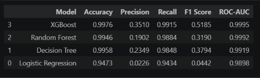
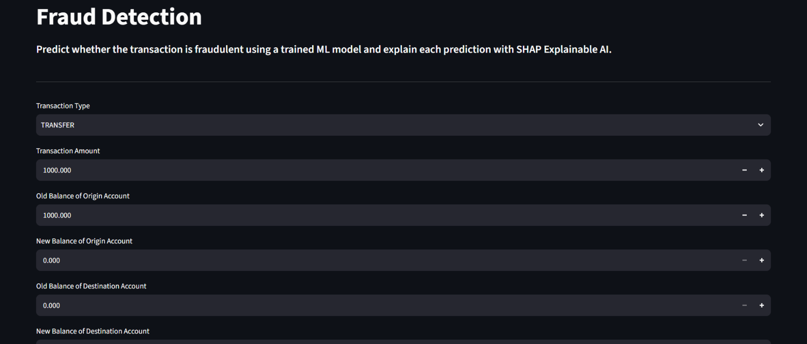
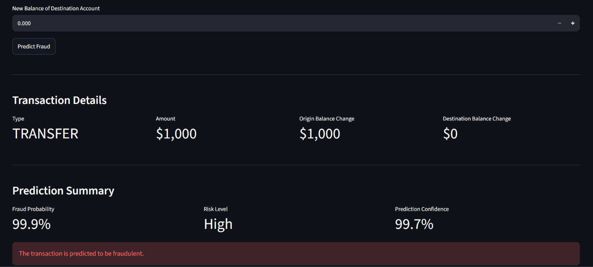
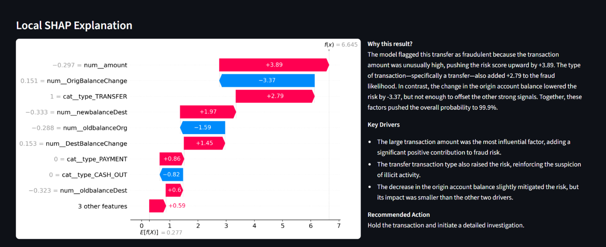

# Fraud Detection Using Machine Learning

## Project Overview

Financial fraud is a major challenge for banks and payment platforms where large number of transactions need to be monitored for potentially suspicious activity. Manually reviewing every transaction is not practical, so a suitable machine learning algorithm can be used to identify transactions that may require further investigation to detect potential frauds.

This project develops an end-to-end machine learning pipeline for detecting fraudulent financial transactions using **XGBoost**. The project focuses on handling severe class imbalance, selecting meaningful transaction features, evaluating multiple classification models, and using **SHAP (Explainable AI)** to understand why the model makes individual predictions.

A **Streamlit web application** provides an interactive interface where users can enter transaction information and receive the prediction, explanation and recommendation.

---

## Business Problem

Financial institutions process millions of transactions every day, making it difficult to manually identify suspicious activity. It is a highly imbalanced classification problem. In real-world financial systems, legitimate transactions greatly outnumber fraudulent transactions.

The objective of this project is to help identify potentially fraudulent transactions while providing interpretable explanations that can support fraud analysts in investigating suspicious activity.The solution aims to:

- Detect potentially fraudulent transactions
- Handle severe class imbalance
- Identify the transaction characteristics most associated with model predictions
- Provide interpretable fraud predictions using SHAP
- Present predictions through an interactive web application

---

## Dataset

**Source:** PaySim Financial Fraud Detection Dataset from Kaggle

---

## 📁 Project Structure
```text
fraud-detection/
│
├── app/
│
│
├── data/
│   ├── raw/
│   └── processed/
│
├── images/
│
├── model/
│
│
├── notebooks/
│
└── README.md

---

## Technologies

`Python` `Pandas` `NumPy` `Scikit-learn` `XGBoost` `SHAP` `Streamlit` `Matplotlib` `Joblib`

---

# Machine Learning Pipeline

Raw Dataset
      ↓
Data Inspection & Cleaning
      ↓
Exploratory Data Analysis
      ↓
Feature Engineering
      ↓
Feature Selection
      ↓
Train/Test Split
      ↓
Feature Preprocessing
      ↓
Class Imbalance Handling
      ↓
Model Training
      ↓
Model Evaluation
      ↓
SHAP Explainability
      ↓
Streamlit App

---

# Models Evaluated

- Logistic Regression
- Decision Tree
- Random Forest
- XGBoost

---
# Final Model Selection 

The XGBoost model was selected as the final model using for fraud detection as it provides the best overall performance based on:
- Precision
- Recall
- F1 Score
- ROC-AUC
- Confusion Matrix



**Accuracy was not treated as the primary metric** because only **0.13% of transactions are fraudulent**. A model could achieve very high accuracy by simply predicting most transactions as legitimate while still missing a large number of fraudulent transactions.

XGBoost was chosen over the other evaluated models because it provided the best overall balance between **detecting fraud (recall), limiting false alarms (precision), maintaining a strong F1 score and separating fraudulent from legitimate transactions (ROC-AUC)**

---

# Key Findings

The analysis revealed some important patterns in fraudulent transactions:

- **Fraud is really rare i.e., ** only **~0.13%**.
- Account balance behaviour is the strongest signal.
- Transaction type matters, particularly **PAYMENT and CASH_OUT**.
- **Feature engineering improved the fraud signal** such as `OrigBalanceChange` and `DestBalanceChange` revealing how money moves between accounts rather than relying only on individual balance values.

# Streamlit Web Application 

The interactive application provides:

- Fraud probability
- Prediction confidence
- Local SHAP explanation plot
- AI-assisted explanation
- Recommended actions

The XGBoost model makes the fraud prediction while SHAP and AI are used to explain the result and recommend actions.




---

# Future Improvements

- Hyperparameter tuning with cross-validation to further optimize XGBoost performance.
- Threshold optimization to find the best balance between fraud detection and false alarms.
- Batch fraud detection for analysing large volumes of transactions simultaneously.
- Continuous model retraining using newly confirmed fraud cases to keep the model up to date.

---

# Author

Mohit
